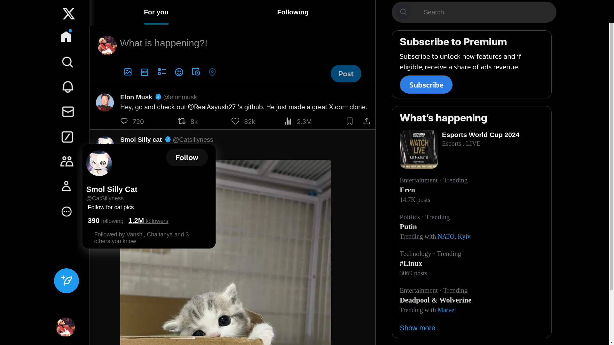

# X.com-frontpage
# X.com Frontpage Clone

This repository contains a clone of the X.com (formerly Twitter) frontpage, built entirely with HTML and CSS. This project was created from scratch without following any tutorials, as a way to solidify my understanding of web development concepts.

## Project Overview

- **Purpose:** This project was developed as a learning exercise to improve my skills in HTML and CSS.
- **Approach:** I took on this project after completing a YouTube frontpage clone using a tutorial. For this project, I challenged myself to design and implement the X.com frontpage entirely on my own, applying the knowledge I gained from the previous project.
- **Features:** 
  - Responsive layout using CSS Grid and Flexbox.
  - Interactive elements with hover effects.
  - Clean and organized code structure.

## Screenshot

Here’s a screenshot of the X.com frontpage clone:



## Lessons Learned

Through this project, I gained deeper insights into:
- The intricacies of CSS layout techniques.
- How to structure HTML for better readability and maintainability.
- The importance of designing responsive and visually appealing interfaces.


## Getting Started

To view the project locally:
1. Clone the repository:  
   ```bash
   git clone https://github.com/OscillatingBlock/X.com-frontpage.git
2. Open index.html in your browser to see the frontpage in action.
## Acknowledgments
This project was inspired by the X.com frontpage, but all the work is original and done independently.

Feel free to explore the code, and any feedback is welcome!
